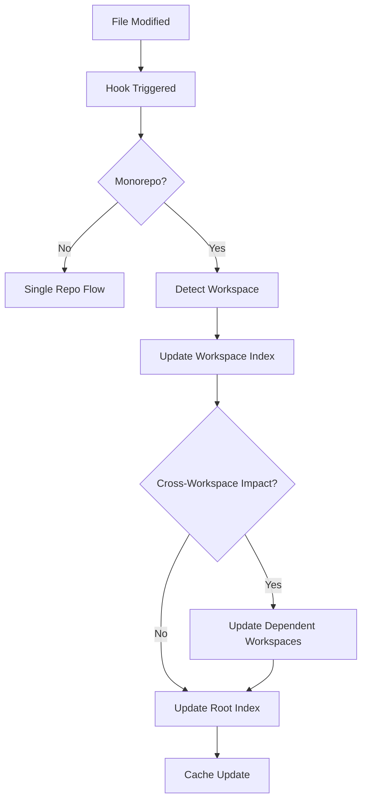
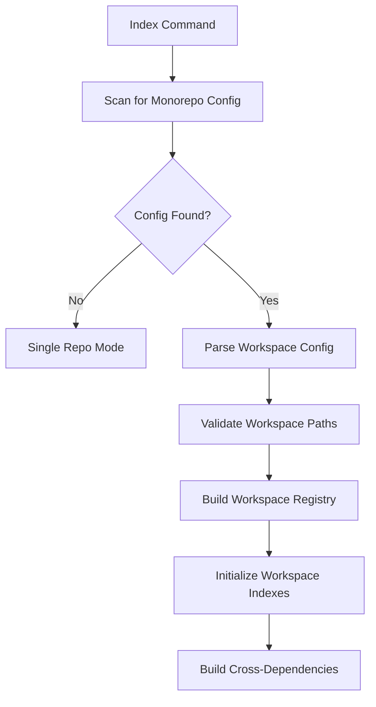

# Monorepo Support MCD (Main Context Document)
*Claude Code Project Index - Hierarchical Monorepo Implementation*

## 🎯 Overview & Goals

### Project Vision
Transform the Claude Code Project Index from a single-repository tool into a comprehensive monorepo-aware system that provides seamless architectural awareness across multiple workspaces while maintaining the simplicity and performance of single-repo operation.

### Target Users
- **Primary**: Developers working in monorepos using tools like Nx, Lerna, PNPM workspaces, Yarn workspaces, Rush
- **Secondary**: Teams migrating from single repos to monorepos who need consistent tooling
- **Tertiary**: Enterprise development teams with complex multi-project architectures

### Core Features
1. **Hierarchical Indexing**: Root index with workspace registry + individual workspace indexes
2. **Automatic Workspace Detection**: Support for common monorepo patterns and tools
3. **Cross-Workspace Dependencies**: Track and visualize dependencies between workspaces
4. **Workspace-Aware Hooks**: Intelligent file change detection and index updates per workspace
5. **Performance Optimization**: Selective indexing and workspace-scoped operations
6. **Seamless Migration**: Zero-configuration upgrade path for existing single-repo users

### Success Criteria
- **Performance**: Workspace switching and indexing operations complete in <2 seconds
- **Compatibility**: 100% backward compatibility with existing single-repo projects
- **Accuracy**: Correctly detect 95%+ of common monorepo configurations
- **Usability**: Zero configuration required for standard monorepo setups
- **Scalability**: Support monorepos with 50+ workspaces without performance degradation

### Business Context
Monorepos are becoming the standard for large-scale development. Major companies (Google, Facebook, Microsoft) use monorepos for their advantages:
- Shared code and dependencies
- Atomic commits across projects
- Simplified dependency management
- Better refactoring capabilities

This enhancement positions Claude Code Project Index as the definitive architectural awareness tool for modern development workflows.

## 🏗️ Technical Architecture

### Hierarchical Index Architecture (Option A)

#### Root Index Structure
```
PROJECT_INDEX.json (root)
├── monorepo: true
├── workspace_registry: {...}
├── cross_workspace_dependencies: {...}
└── global_stats: {...}

packages/api/PROJECT_INDEX.json (workspace)
packages/web/PROJECT_INDEX.json (workspace)  
packages/shared/PROJECT_INDEX.json (workspace)
```

#### Core Components

**1. Workspace Detection Engine**
- **Pattern Recognition**: Scan for monorepo configuration files
- **Heuristic Analysis**: Analyze directory structure for workspace patterns
- **Manual Override**: Support explicit workspace configuration

**2. Index Orchestrator** 
- **Root Index Management**: Maintain workspace registry and cross-dependencies
- **Workspace Index Coordination**: Synchronize individual workspace indexes
- **Dependency Tracking**: Monitor inter-workspace relationships

**3. Hook System Enhancement**
- **Workspace-Aware Routing**: Direct file changes to appropriate workspace index
- **Cascade Updates**: Propagate dependency changes across workspaces
- **Selective Reindexing**: Only update affected workspaces

#### Technology Stack
- **Core Language**: Python 3.8+ (maintains existing compatibility)
- **Configuration Parsing**: JSON, YAML support for various monorepo tools
- **File System Operations**: Pathlib for cross-platform compatibility
- **Process Management**: Subprocess for running workspace-specific commands
- **Caching**: In-memory workspace mapping cache for performance

#### Integration Points
- **Claude Code Hooks**: PostToolUse and Stop hooks with workspace awareness
- **Command System**: Enhanced /index command with workspace options
- **File System**: Smart traversal that respects workspace boundaries

## 📋 Detailed Implementation

### Workspace Detection Patterns

#### Supported Monorepo Tools
1. **PNPM Workspaces** (`pnpm-workspace.yaml`)
   ```yaml
   packages:
     - 'packages/*'
     - 'apps/*'
   ```

2. **Yarn Workspaces** (`package.json`)
   ```json
   {
     "workspaces": ["packages/*", "apps/*"]
   }
   ```

3. **Lerna** (`lerna.json`)
   ```json
   {
     "packages": ["packages/*"],
     "version": "independent"
   }
   ```

4. **Nx** (`nx.json`)
   ```json
   {
     "projects": {
       "api": "packages/api",
       "web": "packages/web"
     }
   }
   ```

5. **Rush** (`rush.json`)
   ```json
   {
     "projects": [
       {
         "packageName": "api",
         "projectFolder": "packages/api"
       }
     ]
   }
   ```

6. **Manual Configuration** (`.project-index-config.json`)
   ```json
   {
     "monorepo": true,
     "workspaces": {
       "pattern": "packages/*",
       "explicit": {
         "api": "packages/api",
         "web": "packages/web"
       }
     }
   }
   ```

### Enhanced Index Schema

#### Root Index Schema
```json
{
  "indexed_at": "2024-01-15T10:30:00Z",
  "root": "/path/to/monorepo",
  "monorepo": {
    "enabled": true,
    "tool": "nx|lerna|yarn|pnpm|rush|manual",
    "config_file": "nx.json|lerna.json|package.json|pnpm-workspace.yaml",
    "workspace_pattern": "packages/*",
    "workspaces": {
      "api": {
        "path": "packages/api",
        "index_path": "packages/api/PROJECT_INDEX.json",
        "last_updated": "2024-01-15T10:25:00Z",
        "dependencies": ["shared"],
        "dependents": []
      },
      "web": {
        "path": "packages/web", 
        "index_path": "packages/web/PROJECT_INDEX.json",
        "last_updated": "2024-01-15T10:28:00Z",
        "dependencies": ["shared"],
        "dependents": []
      },
      "shared": {
        "path": "packages/shared",
        "index_path": "packages/shared/PROJECT_INDEX.json", 
        "last_updated": "2024-01-15T10:20:00Z",
        "dependencies": [],
        "dependents": ["api", "web"]
      }
    }
  },
  "cross_workspace_dependencies": {
    "packages/api": {
      "imports_from": ["packages/shared"],
      "imported_by": [],
      "shared_types": ["User", "Config"]
    },
    "packages/web": {
      "imports_from": ["packages/shared"],
      "imported_by": [],
      "shared_types": ["User", "Theme"]
    }
  },
  "global_stats": {
    "total_workspaces": 3,
    "total_files": 156,
    "total_directories": 23,
    "languages": {
      "typescript": 89,
      "javascript": 45,
      "python": 12
    }
  }
}
```

#### Workspace Index Schema (Enhanced)
```json
{
  "indexed_at": "2024-01-15T10:25:00Z",
  "root": "packages/api",
  "workspace": {
    "name": "api",
    "parent_root": "/path/to/monorepo",
    "dependencies": ["shared"],
    "dependents": [],
    "package_manager": "npm|yarn|pnpm"
  },
  "project_structure": { /* existing structure */ },
  "files": { /* existing files */ },
  "external_dependencies": {
    "workspace_imports": {
      "../shared/types": ["User", "Config"],
      "../shared/utils": ["formatDate", "validateEmail"]
    },
    "npm_dependencies": ["express", "lodash"]
  }
}
```

### Cross-Workspace Dependency Tracking

#### Detection Methods
1. **Static Analysis**: Parse import statements for relative paths crossing workspace boundaries
2. **Package.json Analysis**: Examine workspace dependencies in package managers
3. **TypeScript Project References**: Parse tsconfig.json project references
4. **Symlink Resolution**: Follow symbolic links created by workspace tools

#### Dependency Graph Construction
```python
def build_cross_workspace_dependencies(workspaces):
    """Build dependency graph between workspaces"""
    dependencies = {}
    
    for workspace_name, workspace_info in workspaces.items():
        workspace_deps = []
        
        # Analyze all files in workspace
        for file_path, file_info in workspace_info['files'].items():
            if 'imports' in file_info:
                for import_path in file_info['imports']:
                    # Check if import crosses workspace boundary
                    target_workspace = resolve_workspace_import(
                        import_path, workspace_info['path'], workspaces
                    )
                    if target_workspace and target_workspace != workspace_name:
                        workspace_deps.append(target_workspace)
        
        dependencies[workspace_name] = list(set(workspace_deps))
    
    return dependencies
```

### Performance Optimization Strategies

#### Selective Indexing
- **Incremental Updates**: Only re-index changed workspaces
- **Dependency Cascade**: Update dependents when dependencies change
- **Lazy Loading**: Load workspace indexes on-demand

#### Caching Mechanisms
- **Workspace Mapping Cache**: In-memory cache of workspace locations
- **Dependency Cache**: Cache cross-workspace dependency relationships
- **File System Cache**: Cache directory structures to avoid repeated scanning

#### Parallel Processing
- **Concurrent Indexing**: Index multiple workspaces in parallel
- **Background Updates**: Non-blocking index updates for large workspaces
- **Throttling**: Rate limit index operations to prevent system overload

## 📁 File Structure & Organization

### New Files Structure
```
scripts/
├── monorepo_detector.py          # Workspace detection and configuration
├── workspace_config.py           # Workspace configuration management  
├── workspace_indexer.py          # Workspace-specific indexing logic
├── cross_workspace_analyzer.py   # Dependency analysis across workspaces
└── monorepo_commands.py          # Enhanced CLI commands for monorepo

tests/
├── test_monorepo_detector.py     # Unit tests for workspace detection
├── test_workspace_indexer.py     # Unit tests for workspace indexing
├── fixtures/
│   ├── nx_monorepo/              # Test fixture: Nx workspace
│   ├── lerna_monorepo/           # Test fixture: Lerna workspace  
│   ├── yarn_monorepo/            # Test fixture: Yarn workspaces
│   └── pnpm_monorepo/            # Test fixture: PNPM workspaces

examples/
├── nx_example/                   # Example Nx monorepo configuration
├── lerna_example/                # Example Lerna configuration
└── manual_config_example/        # Example manual configuration
```

### Modified Files
```
scripts/
├── project_index.py              # Add monorepo detection and workspace routing
├── update_index.py               # Enhance for workspace-aware updates
├── reindex_if_needed.py          # Add workspace staleness checking
├── index_utils.py                # Add workspace utility functions
└── find_python.sh               # No changes required

README.md                         # Add monorepo usage documentation
install.sh                        # Add monorepo configuration prompts
```

### File Organization Principles

#### Naming Conventions
- **Workspace Files**: Use prefix `workspace_` for workspace-specific modules
- **Monorepo Files**: Use prefix `monorepo_` for monorepo-wide functionality
- **Test Files**: Mirror source structure with `test_` prefix
- **Example Files**: Use tool name + `_example` suffix

#### Code Organization
- **Separation of Concerns**: Distinct modules for detection, indexing, and analysis
- **Interface Consistency**: Common interface for all monorepo tool integrations
- **Error Handling**: Graceful degradation when monorepo tools are not available
- **Configuration**: Centralized configuration management with tool-specific adapters

#### Environment Setup
```bash
# Development setup
pip install -r requirements-dev.txt    # Add testing dependencies
python -m pytest tests/               # Run test suite
python scripts/monorepo_detector.py   # Test workspace detection
```

## ✅ Task Breakdown & Implementation Plan

### Phase 1: Foundation & Detection (Weeks 1-2)
**Goal**: Establish monorepo detection and basic hierarchical indexing

#### Task 1.1: Workspace Detection Engine
- **Duration**: 3 days
- **Files**: `scripts/monorepo_detector.py`
- **Acceptance Criteria**:
  - Detect Nx, Lerna, Yarn, PNPM, Rush configurations
  - Return standardized workspace mapping
  - Handle edge cases (missing config files, invalid patterns)
  - 95%+ accuracy on common monorepo structures

#### Task 1.2: Workspace Configuration Management
- **Duration**: 2 days  
- **Files**: `scripts/workspace_config.py`
- **Acceptance Criteria**:
  - Load and validate workspace configurations
  - Support manual overrides via `.project-index-config.json`
  - Provide configuration validation and error reporting
  - Cache configuration for performance

#### Task 1.3: Enhanced Root Index Structure
- **Duration**: 2 days
- **Files**: `scripts/project_index.py` (modify)
- **Acceptance Criteria**:
  - Generate root index with workspace registry
  - Maintain backward compatibility for single repos
  - Include workspace metadata and statistics
  - Support workspace discovery commands

#### Task 1.4: Basic Workspace Indexing
- **Duration**: 3 days
- **Files**: `scripts/workspace_indexer.py`
- **Acceptance Criteria**:
  - Generate individual workspace indexes
  - Maintain existing index schema compatibility
  - Include workspace context in each index
  - Handle workspace-specific ignores and configurations

### Phase 2: Hook System Enhancement (Weeks 3-4)
**Goal**: Make hooks workspace-aware with intelligent routing

#### Task 2.1: Workspace-Aware Update Hook
- **Duration**: 4 days
- **Files**: `scripts/update_index.py` (modify)
- **Acceptance Criteria**:
  - Detect which workspace a file belongs to
  - Route updates to appropriate workspace index
  - Update root index when workspace relationships change
  - Handle cross-workspace file moves

#### Task 2.2: Enhanced Staleness Detection
- **Duration**: 3 days
- **Files**: `scripts/reindex_if_needed.py` (modify)  
- **Acceptance Criteria**:
  - Check staleness per workspace independently
  - Trigger selective reindexing of stale workspaces
  - Detect workspace configuration changes
  - Handle workspace additions/removals

#### Task 2.3: Hook Performance Optimization
- **Duration**: 3 days
- **Files**: Multiple hook files
- **Acceptance Criteria**:
  - Sub-2-second response time for file updates
  - Minimal CPU usage for unchanged workspaces
  - Intelligent caching of workspace metadata
  - Graceful handling of large monorepos

### Phase 3: Cross-Workspace Intelligence (Weeks 5-6)
**Goal**: Track and analyze dependencies between workspaces

#### Task 3.1: Cross-Workspace Dependency Analysis
- **Duration**: 5 days
- **Files**: `scripts/cross_workspace_analyzer.py`
- **Acceptance Criteria**:
  - Parse imports that cross workspace boundaries
  - Build dependency graph between workspaces
  - Detect circular dependencies
  - Track shared types and interfaces

#### Task 3.2: Dependency Graph Integration
- **Duration**: 3 days
- **Files**: `scripts/project_index.py` (modify)
- **Acceptance Criteria**:
  - Include cross-workspace dependencies in root index
  - Provide dependency visualization data
  - Support dependency impact analysis
  - Update dependencies when files change

#### Task 3.3: Workspace Relationship Tracking
- **Duration**: 2 days
- **Files**: `scripts/workspace_indexer.py` (modify)
- **Acceptance Criteria**:
  - Track which workspaces import from current workspace
  - Include dependent workspace information
  - Support refactoring impact analysis
  - Maintain relationship consistency

### Phase 4: Advanced Features & Optimization (Weeks 7-8)
**Goal**: Performance optimization and advanced monorepo features

#### Task 4.1: Parallel Workspace Processing
- **Duration**: 4 days
- **Files**: New parallel processing module
- **Acceptance Criteria**:
  - Index multiple workspaces concurrently
  - Maintain thread safety for shared resources
  - Provide progress reporting for large operations
  - Scale to 50+ workspaces efficiently

#### Task 4.2: Advanced Configuration Options
- **Duration**: 2 days
- **Files**: `scripts/workspace_config.py` (enhance)
- **Acceptance Criteria**:
  - Support workspace-specific ignore patterns
  - Allow custom indexing depth per workspace
  - Enable selective workspace inclusion/exclusion
  - Provide configuration validation tools

#### Task 4.3: Enhanced CLI Commands
- **Duration**: 2 days
- **Files**: `scripts/monorepo_commands.py`
- **Acceptance Criteria**:
  - `/index --workspace` for current workspace only
  - `/index --monorepo` for full monorepo indexing
  - `/index --config` for interactive configuration
  - `/index --status` for workspace health overview

### Phase 5: Documentation & Polish (Week 9)
**Goal**: Comprehensive documentation and user experience polish

#### Task 5.1: Documentation Update
- **Duration**: 2 days
- **Files**: `README.md`, new documentation files
- **Acceptance Criteria**:
  - Comprehensive monorepo setup guide
  - Examples for each supported tool
  - Migration guide from single-repo
  - Troubleshooting guide

#### Task 5.2: Example Configurations
- **Duration**: 2 days
- **Files**: `examples/` directory
- **Acceptance Criteria**:
  - Working example for each monorepo tool
  - Sample configurations and expected outputs
  - Best practices documentation
  - Performance optimization examples

#### Task 5.3: Testing & Quality Assurance
- **Duration**: 3 days
- **Files**: Complete test suite
- **Acceptance Criteria**:
  - 90%+ code coverage on new functionality
  - Integration tests for all supported tools
  - Performance benchmarks documented
  - Backward compatibility verified

### Dependencies & Constraints
- **External Dependencies**: None (maintains current zero-dependency approach)
- **Python Version**: Maintain 3.8+ compatibility
- **Performance Constraint**: <2s for workspace operations, <10s for full monorepo indexing
- **Memory Constraint**: <100MB additional memory usage for large monorepos

## 🔗 Integration & Dependencies

### Internal Component Relationships

#### Core Integration Flow
```
File Change Event
├── Hook System (update_index.py)
├── Workspace Detection (monorepo_detector.py)
├── Workspace Resolution (workspace_config.py)  
├── Target Index Update (workspace_indexer.py)
├── Cross-Workspace Analysis (cross_workspace_analyzer.py)
└── Root Index Update (project_index.py)
```

#### Component Dependencies
1. **monorepo_detector.py** → **workspace_config.py**: Configuration loading
2. **workspace_config.py** → **workspace_indexer.py**: Workspace-specific settings
3. **workspace_indexer.py** → **cross_workspace_analyzer.py**: Dependency analysis
4. **cross_workspace_analyzer.py** → **project_index.py**: Root index updates
5. **All Components** → **index_utils.py**: Shared utilities

### External Service Integrations

#### Monorepo Tool Integrations
1. **Nx Integration**
   - Configuration: `nx.json`, `workspace.json`
   - Commands: `nx show projects`, `nx graph`
   - Caching: Leverage Nx cache for performance

2. **Lerna Integration**
   - Configuration: `lerna.json`
   - Commands: `lerna list`, `lerna changed`
   - Version: Support both legacy and modern Lerna

3. **Package Manager Integration**
   - **PNPM**: `pnpm-workspace.yaml`, `pnpm list -r`
   - **Yarn**: `package.json` workspaces, `yarn workspaces list`
   - **NPM**: `package.json` workspaces, `npm query`

#### Claude Code Integration Points
1. **Command System**: Enhanced `/index` command with workspace options
2. **Hook System**: Workspace-aware PostToolUse and Stop hooks  
3. **Settings**: New workspace-specific configuration options
4. **File References**: Workspace-aware file:line references

### Data Flow Architecture

#### Index Update Flow


#### Workspace Discovery Flow


### Error Handling Strategies

#### Graceful Degradation
- **Missing Monorepo Config**: Fall back to single-repo mode
- **Invalid Workspace Path**: Skip workspace with warning
- **Cross-Workspace Error**: Continue with local workspace only
- **Hook Timeout**: Cache previous state, retry in background

#### Error Recovery
- **Corrupted Index**: Rebuild from source code
- **Configuration Conflict**: Use most specific configuration
- **Performance Issues**: Reduce indexing scope automatically
- **Memory Pressure**: Implement index compression

## 🧪 Testing & Validation Strategy

### Unit Testing Strategy

#### Test Categories
1. **Workspace Detection Tests** (`test_monorepo_detector.py`)
   - Configuration file parsing accuracy
   - Edge case handling (missing files, invalid syntax)
   - Performance with large workspace counts
   - Cross-platform path handling

2. **Workspace Indexing Tests** (`test_workspace_indexer.py`)
   - Individual workspace index generation
   - Cross-workspace dependency detection
   - Performance with large workspaces
   - Index schema validation

3. **Hook System Tests** (`test_workspace_hooks.py`)
   - File change routing to correct workspace
   - Cross-workspace update propagation
   - Hook timeout and error handling
   - Performance under concurrent updates

#### Test Data & Fixtures
```
tests/fixtures/
├── nx_monorepo/
│   ├── nx.json
│   ├── packages/
│   │   ├── api/
│   │   ├── web/
│   │   └── shared/
│   └── expected_index.json

├── lerna_monorepo/
│   ├── lerna.json
│   ├── packages/
│   └── expected_index.json

├── yarn_workspaces/
│   ├── package.json (with workspaces)
│   ├── packages/
│   └── expected_index.json

└── pnpm_workspaces/
    ├── pnpm-workspace.yaml
    ├── packages/
    └── expected_index.json
```

### Integration Testing

#### End-to-End Scenarios
1. **Fresh Monorepo Setup**
   - Clone real monorepo (e.g., Nx sample)
   - Run `/index` command
   - Verify complete workspace detection
   - Validate cross-dependencies

2. **File Modification Workflows**
   - Modify file in workspace A
   - Verify workspace A index updates
   - Verify dependent workspace B updates
   - Verify root index reflects changes

3. **Workspace Addition/Removal**
   - Add new workspace to configuration
   - Verify automatic detection and indexing
   - Remove workspace from configuration
   - Verify cleanup and dependency updates

#### Performance Testing
```python
def test_large_monorepo_performance():
    """Test performance with realistic large monorepo"""
    # Setup: 50 workspaces, 1000+ files each
    monorepo = create_large_test_monorepo(
        workspace_count=50,
        files_per_workspace=1000
    )
    
    # Test: Full indexing performance
    start_time = time.time()
    index = build_monorepo_index(monorepo.path)
    total_time = time.time() - start_time
    
    # Assertions: Performance requirements
    assert total_time < 30  # <30s for full index
    assert index['global_stats']['total_workspaces'] == 50
    assert len(index['monorepo']['workspaces']) == 50
    
    # Test: Individual workspace update performance
    start_time = time.time()
    update_workspace_file(monorepo.path / 'packages' / 'api' / 'src' / 'index.js')
    update_time = time.time() - start_time
    
    assert update_time < 2  # <2s for workspace update
```

### Validation Criteria

#### Functional Validation
- ✅ **Workspace Detection**: 95%+ accuracy across supported tools
- ✅ **Index Completeness**: All workspace files and dependencies captured
- ✅ **Cross-Workspace Dependencies**: Accurate dependency graph
- ✅ **Hook Reliability**: 99%+ successful update rate
- ✅ **Backward Compatibility**: Zero breaking changes for single repos

#### Performance Validation  
- ✅ **Workspace Update**: <2 seconds for individual workspace updates
- ✅ **Full Monorepo Index**: <30 seconds for monorepos with 50+ workspaces
- ✅ **Memory Usage**: <100MB additional memory for large monorepos
- ✅ **Hook Latency**: <500ms for file change detection and routing

#### Reliability Validation
- ✅ **Error Recovery**: Graceful handling of corrupted indexes
- ✅ **Configuration Changes**: Automatic adaptation to workspace changes
- ✅ **Concurrent Access**: Thread-safe operations under load
- ✅ **Resource Management**: No memory leaks during long operations

### Automated Testing Pipeline

#### Continuous Integration
```yaml
# .github/workflows/monorepo-tests.yml
name: Monorepo Feature Tests
on: [push, pull_request]

jobs:
  test-monorepo:
    strategy:
      matrix:
        python-version: [3.8, 3.9, 3.10, 3.11]
        monorepo-tool: [nx, lerna, yarn, pnpm, rush]
    
    steps:
    - uses: actions/checkout@v3
    - name: Setup Python ${{ matrix.python-version }}
      uses: actions/setup-python@v3
      with:
        python-version: ${{ matrix.python-version }}
    
    - name: Install monorepo tools
      run: |
        npm install -g @nrwl/cli lerna yarn pnpm @microsoft/rush
    
    - name: Run monorepo tests
      run: |
        python -m pytest tests/test_monorepo_* -v
        python -m pytest tests/test_${{ matrix.monorepo-tool }}_* -v
    
    - name: Performance benchmarks
      run: |
        python tests/benchmark_monorepo.py --tool ${{ matrix.monorepo-tool }}
```

## 🚀 Deployment & Operations

### Environment Configuration

#### Development Environment Setup
```bash
# Clone repository
git clone <repo-url>
cd claude-code-project-index

# Install development dependencies
pip install -r requirements-dev.txt

# Setup pre-commit hooks
pre-commit install

# Run test suite
python -m pytest tests/ -v

# Test monorepo detection
python scripts/monorepo_detector.py examples/nx_example/
```

#### Production Environment Requirements
- **Python**: 3.8+ (maintains existing compatibility)
- **Disk Space**: +50MB for enhanced functionality
- **Memory**: +100MB for large monorepo processing
- **CPU**: No additional requirements
- **Network**: None (remains offline-first)

### Deployment Process

#### Installation Updates
```bash
# Enhanced install.sh additions
INSTALL_DIR="$HOME/.claude-code-project-index"

# Copy new monorepo modules
cp scripts/monorepo_detector.py "$INSTALL_DIR/scripts/"
cp scripts/workspace_config.py "$INSTALL_DIR/scripts/"  
cp scripts/workspace_indexer.py "$INSTALL_DIR/scripts/"
cp scripts/cross_workspace_analyzer.py "$INSTALL_DIR/scripts/"

# Update existing modules with monorepo support
cp scripts/project_index.py "$INSTALL_DIR/scripts/"
cp scripts/update_index.py "$INSTALL_DIR/scripts/"
cp scripts/reindex_if_needed.py "$INSTALL_DIR/scripts/"

# Create examples directory
mkdir -p "$INSTALL_DIR/examples"
cp -r examples/* "$INSTALL_DIR/examples/"
```

#### Migration Strategy

##### Automatic Migration for Existing Users
```python
def migrate_to_monorepo_support():
    """Seamless migration for existing installations"""
    
    # 1. Detect if user is in monorepo
    if detect_monorepo_environment():
        print("🔍 Monorepo detected! Upgrading index structure...")
        
        # 2. Backup existing index
        backup_existing_index()
        
        # 3. Convert to hierarchical structure
        convert_to_hierarchical_index()
        
        # 4. Verify migration success
        if validate_migrated_index():
            print("✅ Successfully migrated to monorepo support!")
        else:
            print("⚠️ Migration failed, restored backup")
            restore_backup()
    else:
        print("ℹ️ Single repository detected - no migration needed")
```

##### Manual Migration Commands
```bash
# Check if current project is monorepo
/index --detect

# Migrate existing index to monorepo structure
/index --migrate

# Force recreation with monorepo detection
/index --monorepo --force
```

### Configuration Management

#### Global Configuration Options
```json
// ~/.claude/settings.json additions
{
  "project_index": {
    "monorepo": {
      "auto_detect": true,
      "default_workspace_pattern": "packages/*",
      "cross_workspace_analysis": true,
      "performance_mode": "balanced", // "fast" | "balanced" | "comprehensive"
      "workspace_cache_ttl": 300, // 5 minutes
      "max_parallel_workspaces": 4
    }
  }
}
```

#### Project-Level Configuration  
```json
// .project-index-config.json
{
  "monorepo": {
    "enabled": true,
    "tool": "nx", // Override auto-detection
    "workspaces": {
      "pattern": "packages/*",
      "explicit": {
        "api": "packages/api",
        "web": "packages/web",
        "shared": "packages/shared"
      },
      "ignore": ["packages/legacy-*"]
    },
    "cross_workspace_dependencies": true,
    "indexing": {
      "max_depth": 10,
      "ignore_patterns": ["*.test.js", "*.spec.ts"],
      "parallel_processing": true
    }
  }
}
```

### Monitoring & Maintenance

#### Health Monitoring
```python
def check_monorepo_health():
    """Monitor monorepo indexing health"""
    health_report = {
        "workspaces": {},
        "performance": {},
        "errors": []
    }
    
    for workspace in get_workspaces():
        health_report["workspaces"][workspace] = {
            "index_age": get_index_age(workspace),
            "file_count": get_workspace_file_count(workspace),
            "last_update": get_last_update_time(workspace),
            "cross_dependencies": get_dependency_count(workspace)
        }
    
    return health_report
```

#### Performance Monitoring
```bash
# Index performance metrics
/index --stats

# Output:
# 📊 Monorepo Index Statistics
# ├── Total Workspaces: 12
# ├── Average Index Time: 1.2s per workspace  
# ├── Cross-Dependencies: 45 relationships
# ├── Cache Hit Rate: 87%
# └── Memory Usage: 85MB
```

#### Maintenance Tasks

##### Automated Maintenance
```python
# Scheduled maintenance tasks
def maintenance_tasks():
    """Run periodic maintenance"""
    
    # 1. Clean up stale workspace caches
    cleanup_workspace_caches()
    
    # 2. Rebuild dependency graphs
    rebuild_cross_workspace_dependencies()
    
    # 3. Optimize index sizes
    compress_large_indexes()
    
    # 4. Validate index integrity
    validate_all_workspace_indexes()
    
    # 5. Update workspace registry
    refresh_workspace_registry()
```

##### Manual Maintenance Commands
```bash
# Clean up all caches
/index --cleanup

# Rebuild all workspace indexes
/index --rebuild-all

# Validate index integrity
/index --validate

# Show workspace dependency graph
/index --show-dependencies
```

### Scaling Considerations

#### Large Monorepo Optimization
- **Workspace Sampling**: Index subset of large workspaces
- **Lazy Loading**: Load workspace details on-demand
- **Index Compression**: Compress infrequently accessed data
- **Background Processing**: Async updates for non-critical workspaces

#### Performance Tuning
```json
// Performance profiles
{
  "profiles": {
    "fast": {
      "max_files_per_workspace": 1000,
      "skip_dependency_analysis": true,
      "parallel_workspaces": 8
    },
    "balanced": {
      "max_files_per_workspace": 5000,
      "skip_dependency_analysis": false,
      "parallel_workspaces": 4  
    },
    "comprehensive": {
      "max_files_per_workspace": -1, // unlimited
      "skip_dependency_analysis": false,
      "parallel_workspaces": 2,
      "deep_analysis": true
    }
  }
}
```

This comprehensive MCD provides the complete roadmap for implementing hierarchical monorepo support in the Claude Code Project Index tool, ensuring thorough planning across all aspects of development, deployment, and maintenance.