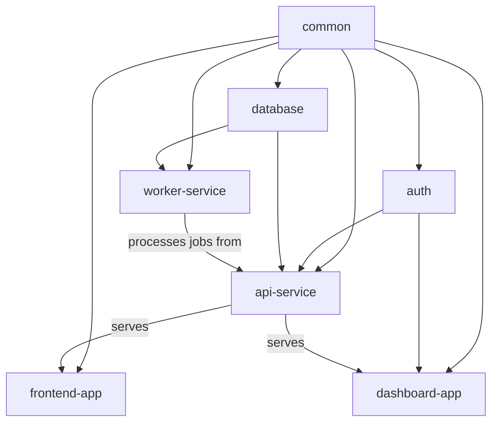

# PNPM Workspace Example

This is a complete working example of a PNPM workspace monorepo configuration for the Project Index system, showcasing advanced PNPM features like catalogs, filtering, and efficient dependency management.

## Structure

```
pnpm_example/
├── pnpm-workspace.yaml     # PNPM workspace configuration
├── package.json            # Root package.json with catalog
├── packages/               # Shared libraries (published)
│   ├── database/          # Database layer with TypeORM
│   ├── auth/              # Authentication utilities
│   └── common/            # Common utilities and types
├── services/              # Backend services (private)
│   ├── api/               # Main API service
│   └── worker/            # Background worker service
└── apps/                  # Frontend applications (private)
    ├── frontend/          # Main frontend with Next.js
    └── dashboard/         # Admin dashboard with Material-UI
```

## Workspaces

### Packages (Published)
- **database** (`packages/database/`) - Database layer with TypeORM, PostgreSQL migrations
- **auth** (`packages/auth/`) - Authentication and authorization utilities with JWT
- **common** (`packages/common/`) - Shared utilities, types, and validation schemas

### Services (Private)
- **api-service** (`services/api/`) - Main API service with Express and GraphQL
- **worker-service** (`services/worker/`) - Background job processing with Bull Queue

### Apps (Private)
- **frontend-app** (`apps/frontend/`) - Main user-facing app with Next.js and React Query
- **dashboard-app** (`apps/dashboard/`) - Admin dashboard with Material-UI and charts

## Key PNPM Features Demonstrated

### Dependency Catalog
Centralized version management in the root `package.json`:
```json
{
  "catalog": {
    "react": "^18.2.0",
    "typescript": "^5.2.2",
    "jest": "^29.5.0"
  }
}
```

### Workspace Protocol
Internal dependencies use `workspace:*`:
```json
{
  "dependencies": {
    "@example/common": "workspace:*",
    "@example/auth": "workspace:*"
  }
}
```

### Filtering and Targeting
- `pnpm --filter="./packages/*" build` - Build only packages
- `pnpm --filter="@example/api-service" test` - Test specific service
- `pnpm -r --parallel run dev` - Run dev in all workspaces

### Efficient Storage
- Shared node_modules with content-addressed storage
- Symlinked workspace dependencies
- Automatic peer dependency resolution

## Setup Instructions

1. **Install PNPM (if not already installed):**
   ```bash
   npm install -g pnpm@8.10.0
   ```

2. **Clone this example:**
   ```bash
   cp -r examples/pnpm_example/ my-pnpm-project
   cd my-pnpm-project
   ```

3. **Install dependencies:**
   ```bash
   pnpm install
   ```

4. **Generate Project Index:**
   ```bash
   python3 ../../scripts/project_index.py
   ```

5. **Verify detection:**
   ```bash
   # Should show pnpm-workspace.yaml detected
   jq '.monorepo_info.tool' PROJECT_INDEX.json
   
   # Should show 7 workspaces
   jq '.workspace_registry | keys | length' PROJECT_INDEX.json
   ```

## Expected Output

After running the project indexer, you should see:

```json
{
  "monorepo_info": {
    "detected": true,
    "tool": "pnpm",
    "config_file": "pnpm-workspace.yaml", 
    "workspace_count": 7,
    "package_manager": "pnpm"
  },
  "workspace_registry": {
    "database": {
      "path": "packages/database",
      "version": "2.1.0",
      "package_manager": "pnpm"
    },
    "auth": {
      "path": "packages/auth",
      "version": "1.5.2",
      "package_manager": "pnpm"
    },
    "common": {
      "path": "packages/common",
      "version": "0.9.1",
      "package_manager": "pnpm"
    },
    "api-service": {
      "path": "services/api",
      "private": true,
      "package_manager": "pnpm"
    },
    "worker-service": {
      "path": "services/worker", 
      "private": true,
      "package_manager": "pnpm"
    },
    "frontend-app": {
      "path": "apps/frontend",
      "private": true,
      "package_manager": "pnpm"
    },
    "dashboard-app": {
      "path": "apps/dashboard",
      "private": true,
      "package_manager": "pnpm"
    }
  },
  "cross_workspace_dependencies": {
    "dependencies": {
      "auth": ["common"],
      "api-service": ["database", "auth", "common"],
      "worker-service": ["database", "common"],
      "frontend-app": ["common"],
      "dashboard-app": ["common", "auth"]
    }
  }
}
```

## PNPM Commands

### Development Workflow

```bash
# Install all dependencies
pnpm install

# Build all workspaces
pnpm -r run build

# Run development mode in parallel
pnpm -r --parallel run dev

# Test all workspaces
pnpm -r run test

# Lint all workspaces
pnpm -r run lint
```

### Filtering Commands

```bash
# Build only packages
pnpm --filter="./packages/*" run build

# Test only services
pnpm --filter="./services/*" run test

# Run specific workspace
pnpm --filter="@example/api-service" run dev

# Build with dependencies
pnpm --filter="@example/frontend-app" --include-dependencies run build

# Deploy services
pnpm --filter="./services/*" run deploy
```

### Workspace Management

```bash
# Add dependency to specific workspace
pnpm --filter="@example/api-service" add express

# Add dev dependency with catalog
pnpm --filter="@example/frontend-app" add -D typescript@catalog:

# Update all dependencies
pnpm -r update

# Remove dependency from workspace
pnpm --filter="@example/common" remove lodash
```

## Project Index Commands

Once indexed, you can use workspace-specific commands:

```bash
# Index specific workspace
python3 ../../scripts/project_index.py --workspace database

# Index by pattern
python3 ../../scripts/project_index.py --workspace-pattern "packages/*"

# View dependencies
python3 ../../scripts/project_index.py --dependencies

# Performance check
time python3 ../../scripts/project_index.py
```

## Performance Expectations

This example should meet these benchmarks:
- **Full indexing**: <4 seconds (7 workspaces)
- **Workspace updates**: <180ms
- **Memory usage**: <55MB additional

## Advanced PNPM Features

### Catalog Usage
```bash
# Add package using catalog version
pnpm add typescript@catalog:

# Update catalog versions
pnpm update --latest
```

### Workspace Linking
```bash
# Link workspace packages automatically
pnpm install --link-workspace-packages

# Force workspace protocol
pnpm install --save-workspace-protocol
```

### Publishing Strategy
```bash
# Publish only public packages
pnpm -r --filter="./packages/*" publish

# Publish with access control
pnpm publish --access public
```

## Configuration Customization

The `project-index-config` section in `pnpm-workspace.yaml` shows customization:

```yaml
project-index-config:
  performance_mode: "balanced"
  cross_workspace_analysis: true
  workspace_overrides:
    database:
      language_hints: ["typescript", "sql"]
      ignore_patterns: ["*.spec.ts", "dist/", "migrations/"]
    frontend:
      language_hints: ["typescript", "javascript", "css", "scss"]
      ignore_patterns: ["*.test.tsx", "build/", ".next/", "coverage/"]
```

## Integration with Claude Code

Add to your `CLAUDE.md`:

```markdown
@PROJECT_INDEX.json

This PNPM workspace monorepo contains 7 workspaces:
- packages/database: Database layer with TypeORM
- packages/auth: Authentication utilities
- packages/common: Shared utilities and types
- services/api: Main API service with GraphQL
- services/worker: Background job processing
- apps/frontend: Next.js frontend application
- apps/dashboard: Admin dashboard with Material-UI

Use `/index --workspace <name>` for workspace-specific operations.
Use `pnpm --filter="pattern" command` for filtered operations.
```

## Dependency Graph



## Best Practices Demonstrated

1. **Catalog usage**: Centralized dependency version management
2. **Workspace protocols**: Proper internal dependency linking
3. **Filtering**: Efficient build and test targeting
4. **Hoisting patterns**: Optimized dependency sharing
5. **Mixed architectures**: Packages, services, and apps structure
6. **Performance tuning**: Workspace-specific ignore patterns
7. **Type safety**: Comprehensive TypeScript setup

## Troubleshooting

**PNPM not found:**
```bash
npm install -g pnpm
# Verify installation
pnpm --version
```

**Workspace linking issues:**
```bash
# Clean and reinstall
pnpm store prune
rm -rf node_modules
pnpm install
```

**Catalog version conflicts:**
```bash
# Check catalog
pnpm list --depth=0
# Update catalog
pnpm update --latest
```

**Filtering not working:**
```bash
# List workspaces
pnpm list -r --depth=0
# Check workspace patterns
pnpm list --filter="./packages/*"
```

## Advanced Patterns

### Changesets Integration
```bash
# Add changeset
pnpm changeset

# Version packages
pnpm changeset version

# Publish
pnpm changeset publish
```

### Turbo Integration
```bash
# Add turbo for build optimization
pnpm add -Dw turbo

# Configure turbo.json for caching
pnpm turbo build --cache-dir=.turbo
```

### Docker Multi-stage
```dockerfile
FROM node:18-alpine as base
RUN npm install -g pnpm
COPY pnpm-lock.yaml ./
COPY pnpm-workspace.yaml ./
COPY package.json ./

FROM base as deps
RUN pnpm fetch --prod

FROM base as build
COPY . .
RUN pnpm install --offline
RUN pnpm build
```

This example showcases PNPM's advanced features while demonstrating how the Project Index system provides comprehensive workspace awareness and dependency analysis for complex monorepo structures.